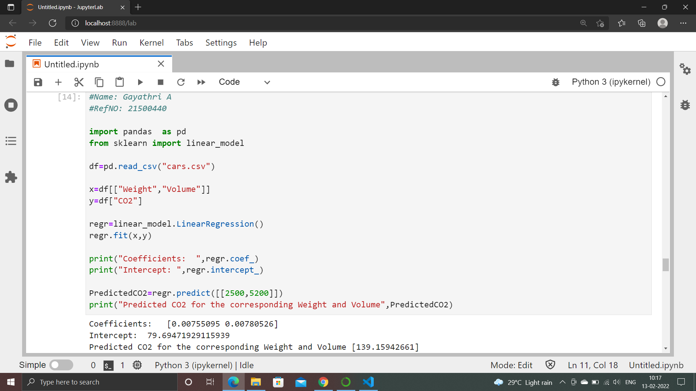

# Read-from-CSV

## AIM:
To write a python program for reading the csv file content.

## ALGORITHM:
# Step 1:
Load the CSV into a DataFrame.

# Step 2:
Print the number of contents to be displayed using df.head().

# Step 3:
The number of rows returned is defined in Pandas option settings.

# Step 4:
Check your system's maximum column with the pd.options.display.max_column statement.

# Step 5:
Increase the maximum number of rows to display the entire DataFrame.

## PROGRAM:
``` python
import pandas  as pd
from sklearn import linear_model

df=pd.read_csv("cars.csv")

x=df[["Weight","Volume"]]
y=df["CO2"]

regr=linear_model.LinearRegression()
regr.fit(x,y)

print("Coefficients:  ",regr.coef_)
print("Intercept: ",regr.intercept_)

PredictedCO2=regr.predict([[2500,5200]])
print("Predicted CO2 for the corresponding Weight and Volume",PredictedCO2)
```

## OUTPUT:

## RESULT:
Thus the program is written to read the csv file.